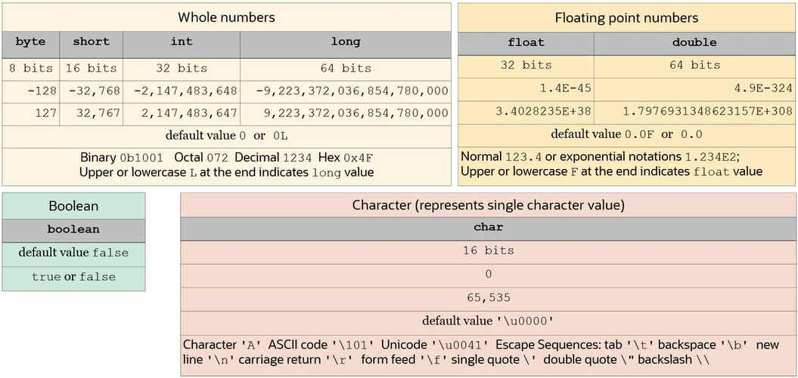

# Data Types

### Primitive Declarations and Initializations:
1. Numeric values can be expressed as binary, octal, decimal, and hex.
2. Float and double values can be expressed in normal or exponential notations.
3. Assignment of one variable to another creates a copy of a value.
4. Smaller types are automatically promoted to bigger types.
5. Character values must be enclosed in single quotation marks.
```java
int a = 0b101010;   // binary
short b = 052;         // octal
byte c = 42;             // decimal
long d = 0x2A;        // hex
char j = 'A' ,  k = '\u0041' , l = '\101';
```

#### Restrictions on Primitive Declarations and Initializations:

1. Variable must be initialized before use.
2. A bigger type value cannot be assigned to a smaller type variable.
3. Character value must not be enclosed in double quotation marks.
4. A character value cannot contain more than one character.
5. Boolean values can be expressed only as true or false (in lower case).

> Each incorrect example given here would cause Java code not to compile.
```java
byte a;
byte b = a;
byte c = 128;
int d = 42L;
float e = 1.2;
char f = "a";
char g = 'AB';
boolean h = "true";
boolean i = 'false';
boolean j = 0;
boolean k = False; 
```