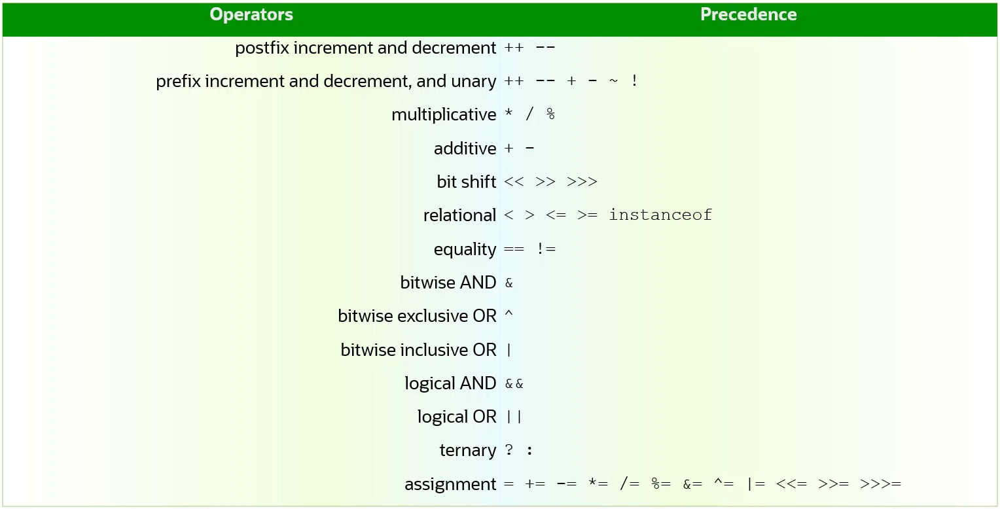

# Operators


### Assignment and Arithmetic Operators

1. Smaller types are automatically casted (promoted) to bigger types. 
    > byte > short > char > int > long > float > double
2. A bigger type value cannot be assigned to a smaller type variable without 
explicit type casting.
3. When casting a bigger value to a smaller type, beware of a possible overflow.
4. The Resulting type of arithmetic operations on types smaller than int is an int;
Otherwise, the result is of a type of the largest participant.

##### Example:
```java
byte a = 127, b = 5;
byte c = a + b;             // compilation fails. result a + b will be of int type, reason point 4.
byte d = (byte) (a + b);    // d is -124; type overflow, because 127 is the max byte value.
float e = a/b;              // e is 25.0F (result of the a/b can be implicitly 
float f = (byte) (a/b);     //              or explicitly cast to float, but a/b is still 25)
float g = (float) a/b;      // when either a
float h = a/(float) b;      // or b float the a/b becomes float
b = (byte) b+1;             // explicit casting is required, because b+1 is an int
b++;                        // no casting is required for ++ and -- operators
char x = 'A';
char y = x++;               // arithmetic operations work with character codes
```